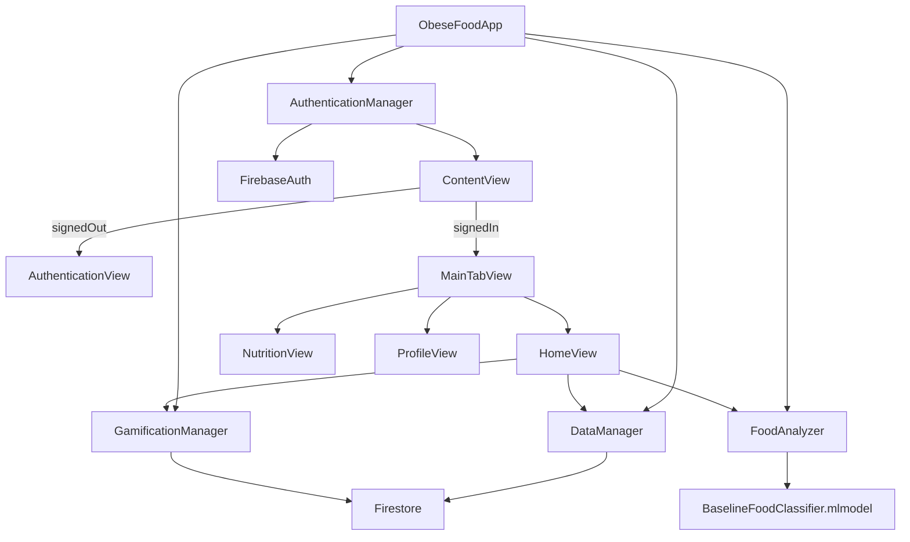

# Obese Food Architecture

## Overview

The current architecture is centered on a single SwiftUI iOS target backed by Firebase Auth and Firestore. The MVP keeps the app simple:

- authentication gates access to the main tabs
- meal analysis runs on-device through a bundled CoreML model
- nutrition history and profile data are cached locally and synced to Firestore
- gamification progress is stored locally and mirrored to Firestore

## Main Flow

## Modules

### `AuthenticationManager`

- Wraps Firebase Auth
- Publishes the signed-in user and auth state
- Drives the app’s signed-in versus signed-out experience

### `DataManager`

- Owns `UserProfile` and `FoodScan`
- Uses local `UserDefaults` storage keyed by Firebase user ID
- Syncs `userProfiles` and `foodScans` collections to Firestore
- Seeds a default profile for a newly signed-in user when needed

### `GamificationManager`

- Tracks Oex points, streaks, achievements, weekly goal, and weekly progress
- Saves progress locally per user
- Mirrors progress to the `userProgress` Firestore collection

### `FoodAnalyzer`

- Loads the bundled `BaselineFoodClassifier.mlmodel`
- Extracts lightweight color and brightness features from the selected image
- Produces a meal prediction and confidence score
- Uses `FoodCatalog` for nutrition mapping and low-confidence fallback handling

### `FoodCatalog`

- Defines the supported MVP dishes
- Provides calorie and macro estimates for saved meal scans
- Drives both scan fallback choices and the nutrition guide screen

## Persistence Model

### Local

- `UserDefaults` per user for:
  - profile
  - scan history
  - gamification progress

### Firebase

- `userProfiles/{userId}`
- `foodScans/{scanId}`
- `userProgress/{userId}`

## Security Model

The repo now includes Firestore rules that restrict reads and writes to the authenticated owner of each document, plus a composite index for:

- `foodScans` filtered by `userId`
- ordered by `timestamp` descending

## Current Constraints

- The CoreML model is a baseline classifier for a small dish set, not a production-grade food model yet.
- The app currently uses the photo library flow; camera capture can be added later if needed.
- Profile photos are intentionally not persisted until a real storage pipeline is added.
